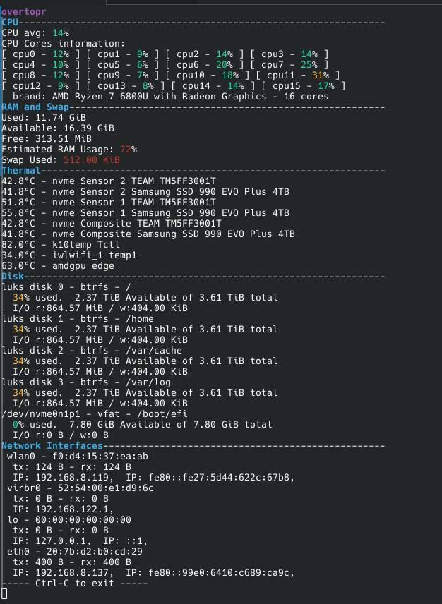

# overtopr
Overtopr is a system monitor written in Rust by **Tessa Hall**.

## screenshots
- Linux
  - 

[Final project](https://fpl.cs.depaul.edu/cpitcher/courses/csc363/worksheets/project.html) (DePaul University internal link) for for my Theory and Practice of Safe Systems Programming CSC-463 class. This is not an alternative to `top`, `ps` or any other process monitors; there is no process listing. This is a refreshing display of general computer system resource utilization aiming for breadth rather than depth.

## compilation/usage

- `cd overtop` (from root of this repository)
- `cargo build`
- `cargo run` to test. Ctrl-C to quit for now.

## Feature roadmap
I've changed this a bit, aside from the core feature milestones, which have all already been met. Some extra optional features have been cut over time to prevent project scope creep and increased dependency compatibility issues across OSs.

Key:
- [ ] unimplemented
- [x] implemented
- [x] :white_check_mark: implemented & pretty

- [x] :white_check_mark: List memory utilization (RAM)
  - [x] Used
  - [x] Available
  - [x] Free
  - [x] Swap usage
- [x] :white_check_mark: List CPU utilization
  - [x] Totals
	- [x] Temperature
	- [x] Average CPU core utilization %
	- [x] CPU Model
  - [x] Number of cores available
  - [x] CPU utilization % per-core
  - [x] CPU Frequency per-core
- [x] :white_check_mark: list current network interfaces
  - [x] list network interfaces
  - [x] IP address (inet) (if applicable)
  - [x] MAC address (link) (if applicable)
  - [x] Network interface statistics
- [x] :white_check_mark: Disk Utilization
  - [x] Disk metadata
  - [x] Disk utilization
  - [x] Disk bytes I/O in last refresh
- [x] :white_check_mark: Clean Ctrl-C interrupt, exit code zero
- [x] (stretch goal) Terminal Decoration
  - color-code system monitor readouts between green, yellow, and red based on thresholds, red indicating "bad"/"high-utilization"
	- [x] percentages
	- [x] fractions (RAM utilization / Disk utilization)
  - prettier general printout
	- [x] make CPU cores printout utilize terminal columns efficiently
	- [x] pretty padding/spacing

Basically, this would serve as an okay if very basic and broad Linux server monitor. However, there is tested support for Linux, Mac, and Windows (caveat: Windows doesn't expose hardware components information via the sysinfo crate, so it doesn't have thermals).

# Rust crates used

- [sysinfo crate](https://doc.cuprate.org/sysinfo/index.html) Using this.
  - supports linux/bsd/windows/$LATESTNAMEFORAPPLEOS
  - basic system utilization info
  - limited network monitoring utility
- [byte-unit](https://lib.rs/crates/byte-unit) Using this.
  - For dynamically selecting the right display SI prefix for displayed byte values
- [ctrl-c crate](https://docs.rs/ctrlc/latest/ctrlc/) Using this for clean-exit.
- [clearscreen crate](https://docs.rs/clearscreen/latest/clearscreen/) Using this for screen refreshes.
- [crossterm crate](https://docs.rs/crossterm/latest/crossterm/) Using this for terminal colors/styles.
