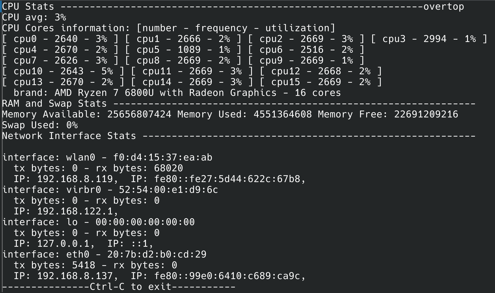

# overtopr
Overtopr will be a system monitor written in Rust by **Tessa Hall**. Still an early work in progress. See roadmap for actual progress.

[Final project](https://fpl.cs.depaul.edu/cpitcher/courses/csc363/worksheets/project.html) (DePaul University internal link) for for my Theory and Practice of Safe Systems Programming CSC-463 class.

## compilation/usage

- `cd overtop` (from root of this repository)
- `cargo build`
- `cargo run` to test. Ctrl-C to quit for now.

## Summary overview

I will try to implement as many of the below features as possible. However unlike "top" or similair system process monitors I want a CLI/TUI system overview from a more abstract level, without individual processes. Instead the most granular element of the system to inspect in the monitor will be the status of various system services, catering towards systemd units, but written with traits for extensibility for services of different init systems. The rest of the system monitor output will be typical (if more visually concise) system resource utilization you would expect from a normal system resource monitor.

Since I don't intend on setting up a TUI unless time permits, the initial command will output the full system monitor summary to be piped into a pager or saved to a file. Then later I could add a flag to enable the TUI.

I will be developing this on my Arch Linux machine targeting a typical Systemd environment. I hope that compatibilty will be broader than my distrobution, but I might not be able to make guarantees. In any case, anything which fails should fail safely.

## Feature roadmap
I am including as much as I can think of under this feature roadmap in order of which features should be implemented first. This is not to be taken as my realistic expectations for what I may actually be able to finish before the project is due, but just an outline of what more could be done.

Key:
- [ ] unimplemented
- [x] implemented
- [x] :white_check_mark: implemented & pretty

- [x] :white_check_mark: List memory utilization (RAM)
  - [x] Used
  - [x] Available
  - [x] Free
  - [x] Swap usage
- [x] :white_check_mark: List CPU utilization
  - [x] Totals
	- [x] Temperature
	- [x] Average CPU core utilization %
	- [x] CPU Model
  - [x] Number of cores available
  - [x] CPU utilization % per-core
  - [x] CPU Frequency per-core
- [x] list current network interfaces
  - [x] list network interfaces
  - [x] IP address (inet) (if applicable)
  - [x] MAC address (link) (if applicable)
  - [x] Network interface statistics
- [ ] (stretch goal) usage text and limited arguments/flags for options

Basically, this would serve as an okay if very basic and broad Linux server monitor.

# Potentially relevant Rust crates

- [sysinfo crate](https://doc.cuprate.org/sysinfo/index.html) Using this.
  - supports linux/bsd/windows/$LATESTNAMEFORAPPLEOS
  - basic system utilization info
  - limited network monitoring utility
- [byte-unit](https://lib.rs/crates/byte-unit) Using this.
  - For dynamically selecting the right display SI prefix for displayed byte values
- [Linux /proc fs interface crate](https://docs.rs/procfs/latest/procfs/index.html) Haven't used this yet.
  - Specifically useful for the [net module](https://docs.rs/procfs/latest/procfs/net/index.html)
